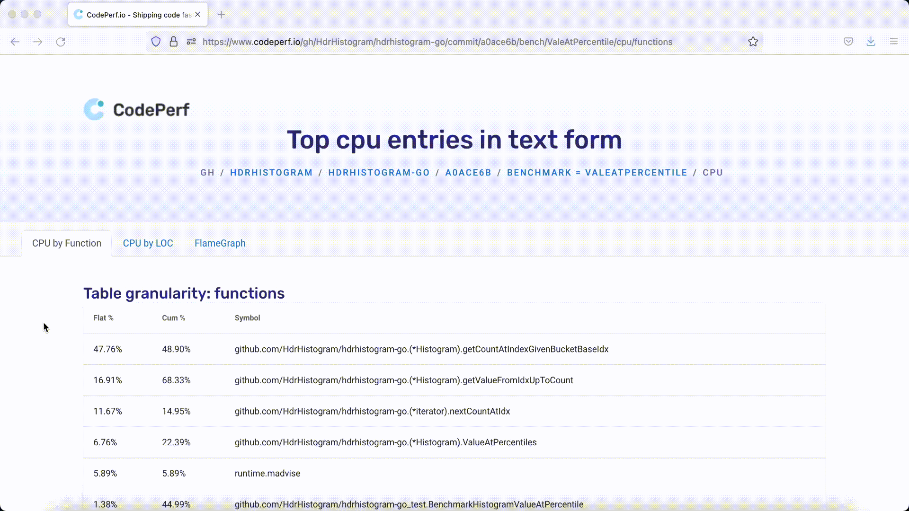

# example-go
Simple Golang project up and running with benchmarks and code profiling with CodePerf.

Check https://docs.codeperf.io/getting-started/go for the full steps.

And the sample GUI of it at:

- Top CPU by functions: https://www.codeperf.io/gh/codeperfio/example-go/commit/fbf8d67/bench/BenchmarkFib10/cpu/functions
- Top CPU by LOC: https://www.codeperf.io/gh/codeperfio/example-go/commit/fbf8d67/bench/BenchmarkFib10/cpu/lines
- Flame Graph: https://www.codeperf.io/gh/codeperfio/example-go/commit/fbf8d67/bench/BenchmarkFib10/cpu/flamegraph

